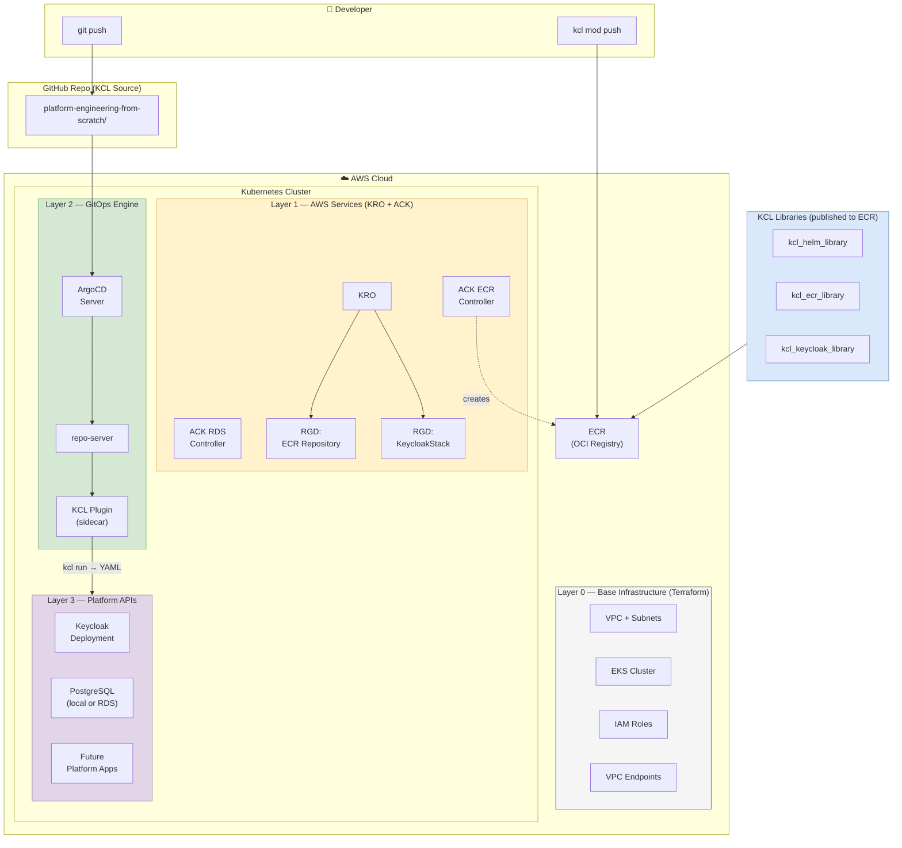

# Platform Architecture

```mermaid
flowchart TB
    subgraph DEV["👤 Developer"]
        git_push["git push"]
        kcl_push["kcl mod push"]
    end

    subgraph GITHUB["GitHub Repo (KCL Source)"]
        kcl_src["platform-engineering-from-scratch/"]
    end

    subgraph AWS["☁️ AWS Cloud"]

        subgraph L0["Layer 0 — Base Infrastructure (Terraform)"]
            VPC["VPC + Subnets"]
            EKS["EKS Cluster"]
            IAM["IAM Roles"]
            VPCE["VPC Endpoints"]
        end

        ECR["ECR\n(OCI Registry)"]

        subgraph K8S["Kubernetes Cluster"]

            subgraph L1["Layer 1 — AWS Services (KRO + ACK)"]
                KRO["KRO"]
                ACK_ECR["ACK ECR\nController"]
                ACK_RDS["ACK RDS\nController"]
                RGD_ECR["RGD:\nECR Repository"]
                RGD_KC["RGD:\nKeycloakStack"]
            end

            subgraph L2["Layer 2 — GitOps Engine"]
                ARGO["ArgoCD\nServer"]
                REPO["repo-server"]
                KCL_PLUGIN["KCL Plugin\n(sidecar)"]
            end

            subgraph L3["Layer 3 — Platform APIs"]
                KC["Keycloak\nDeployment"]
                PG["PostgreSQL\n(local or RDS)"]
                FUTURE["Future\nPlatform Apps"]
            end
        end
    end

    subgraph LIBS["KCL Libraries (published to ECR)"]
        LIB_HELM["kcl_helm_library"]
        LIB_ECR["kcl_ecr_library"]
        LIB_KC["kcl_keycloak_library"]
    end

    git_push --> kcl_src
    kcl_push --> ECR
    kcl_src --> ARGO
    ARGO --> REPO --> KCL_PLUGIN
    KCL_PLUGIN -->|"kcl run → YAML"| L3
    ACK_ECR -.->|creates| ECR
    LIBS --> ECR
    KRO --> RGD_ECR
    KRO --> RGD_KC

    style L0 fill:#f5f5f5,stroke:#666
    style L1 fill:#fff2cc,stroke:#d6b656
    style L2 fill:#d5e8d4,stroke:#82b366
    style L3 fill:#e1d5e7,stroke:#9673a6
    style LIBS fill:#dae8fc,stroke:#6c8ebf
```
