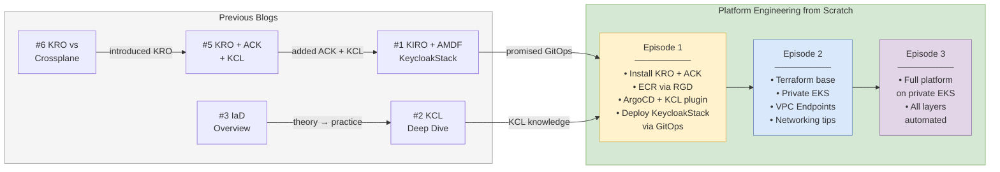

# Blog Series Flow

```mermaid
flowchart LR
    subgraph PAST["Previous Blogs"]
        B6["#6 KRO vs\nCrossplane"]
        B5["#5 KRO + ACK\n+ KCL"]
        B3["#3 IaD\nOverview"]
        B2["#2 KCL\nDeep Dive"]
        B1["#1 KIRO + AMDF\nKeycloakStack"]
    end

    subgraph SERIES["Platform Engineering from Scratch"]
        EP1["Episode 1\n─────────\n• Install KRO + ACK\n• ECR via RGD\n• ArgoCD + KCL plugin\n• Deploy KeycloakStack\n  via GitOps"]
        EP2["Episode 2\n─────────\n• Terraform base\n• Private EKS\n• VPC Endpoints\n• Networking tips"]
        EP3["Episode 3\n─────────\n• Full platform\n  on private EKS\n• All layers\n  automated"]
    end

    B6 -->|"introduced KRO"| B5
    B5 -->|"added ACK + KCL"| B1
    B3 -->|"theory → practice"| B2
    B1 -->|"promised GitOps"| EP1
    B2 -->|"KCL knowledge"| EP1
    EP1 --> EP2 --> EP3

    style PAST fill:#f5f5f5,stroke:#999
    style SERIES fill:#d5e8d4,stroke:#82b366
    style EP1 fill:#fff2cc,stroke:#d6b656
    style EP2 fill:#dae8fc,stroke:#6c8ebf
    style EP3 fill:#e1d5e7,stroke:#9673a6
```
